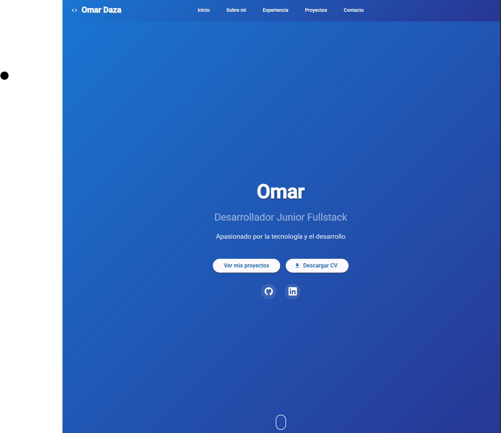

# 🚀 Portfolio Personal - Omar

[](https://angular.io/)
[](https://vercel.com)
[](https://opensource.org/licenses/MIT)

<div align="center">
  
</div>

## ✨ Características

- ✅ **Diseño moderno**
- ✅ **Animaciones y transiciones suaves**

## 🛠️ Tecnologías Utilizadas

- **Frontend:** Angular 19, TypeScript, HTML5, CSS3
- **Deploy:** Vercel
- **Iconos:** [Font Awesome](https://fontawesome.com/)
- **Fuentes:** [Google Fonts](https://fonts.google.com/)

## 🚀 Cómo Ejecutar Localmente

```bash
# Clonar el repositorio
git clone https://github.com/OmarDZC/Portfolio.git

# Instalar dependencias
npm install

# Servidor de desarrollo
ng serve

# Abrir en http://localhost:4200
